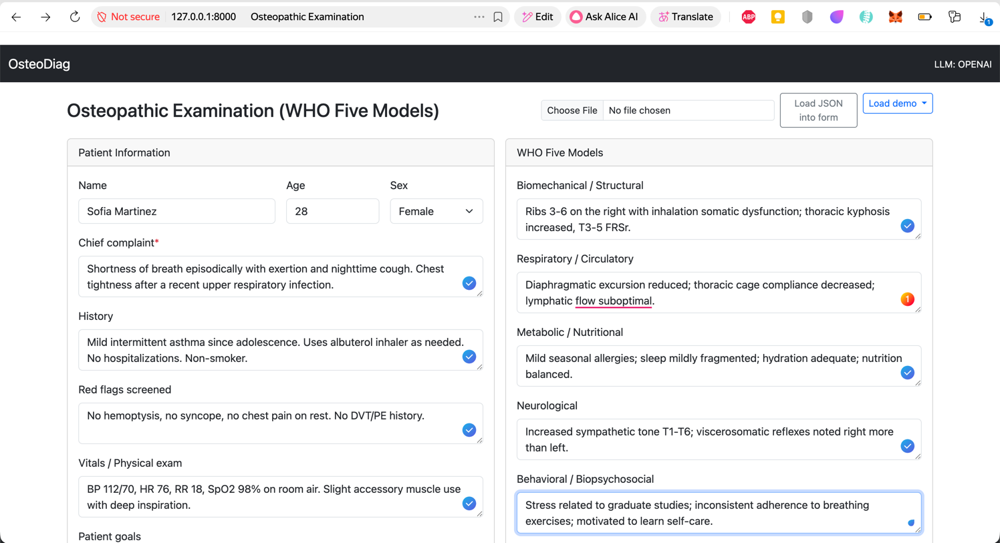
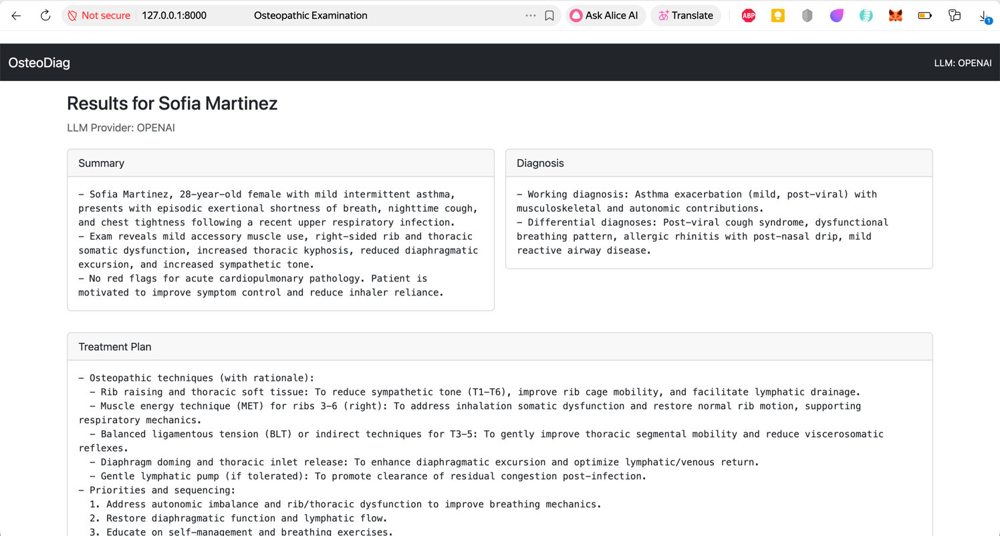

# Osteopathic Examination Web App

An adaptive (desktop, mobile, tablet) Flask + Bootstrap web application for conducting a comprehensive osteopathic examination using the five WHO models. The app uses an LLM (Ollama, OpenAI, or Gemini) to generate a clinical summary, differential/working diagnosis, and an osteopathic treatment plan.




## Features
- Responsive Bootstrap UI
- Internationalization (i18n) with per-page language selector (English, German, French, Greek, Russian, Spanish, Chinese, Japanese)
- Captures patient demographics and findings per five WHO models
- Upload a ready JSON file to prefill the form (or load built-in demo cases)
- Selectable LLM backend via environment (.env): OLLAMA, OPENAI, GEMINI
- Generates: 
  - Concise Summary
  - Diagnosis (working + differentials)
  - Osteopathic treatment plan (prioritized, contraindications, follow-up)

## Quickstart

1. Ensure Python 3.13 is installed.
2. Create and activate a virtual environment.
   ```bash
   python3.13 -m venv .venv
   source .venv/bin/activate
   ```
3. Install dependencies:
   ```bash
   pip install -r requirements.txt
   ```
4. Copy configuration and set provider/keys:
   ```bash
   cp .env.example .env
   # Edit .env to set LLM_PROVIDER and related keys
   ```
5. Run the app:
   ```bash
   python app.py
   ```
6. Open http://localhost:8000 in your browser.

### Prefill via JSON upload
- Prepare a JSON file with these keys (all optional except chief_complaint for analysis):
  - name, age, sex, chief_complaint, history, red_flags, vitals, goals,
    biomechanical, respiratory, metabolic, neurological, behavioral
- On the top-right of the form, use "Load JSON into form" to upload your file and prefill fields.
- Or use the "Load demo" menu to load one of the built-in examples from `demo-data/`.

Examples available:
- demo-data/low-back-pain.json
- demo-data/asthma-rib-dysfunction.json
- demo-data/chronic-fatigue-metabolic.json

## Environment variables (.env)
See `.env.example`. Key items:
- LLM_PROVIDER: OLLAMA | OPENAI | GEMINI
- OLLAMA_BASE_URL, OLLAMA_MODEL
- OPENAI_API_KEY, OPENAI_MODEL
- GEMINI_API_KEY, GEMINI_MODEL
- FLASK_DEBUG, FLASK_SECRET_KEY, HOST, PORT

## Notes
- For Ollama, install and run Ollama locally and pull the specified model (e.g., `ollama pull llama3.1`).
- For OpenAI or Gemini, set API keys appropriately.
- This app is for educational/assistive purposes; not a substitute for clinical judgment.
